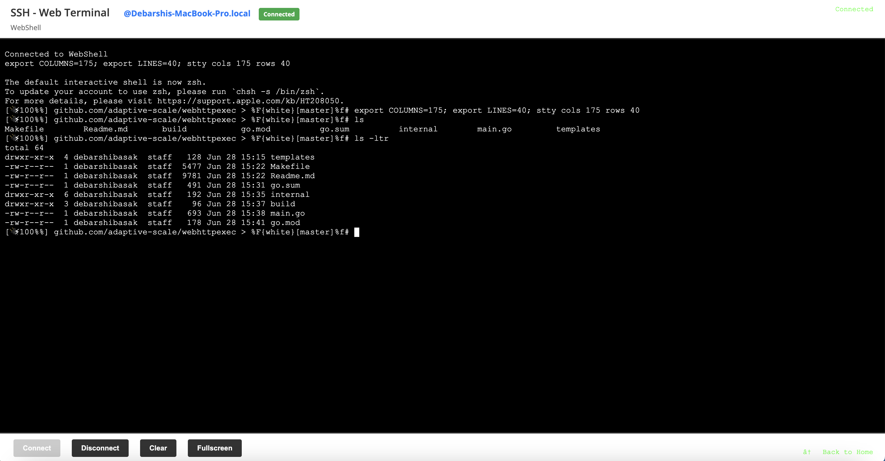

## WebShell

A secure HTTP server that can execute CLI commands via REST API endpoints using simple raw body requests. Returns command output as raw text by default, with JSON metadata available on request. Includes a full-featured web SSH terminal for interactive shell access.



## Quick Install

### Automatic Installation (Recommended)

```bash
# Install latest version
curl -fsSL https://raw.githubusercontent.com/adaptive-scale/webshell/master/install.sh | bash

# Install specific version
curl -fsSL https://raw.githubusercontent.com/adaptive-scale/webshell/master/install.sh | bash -s v1.0.0
```

### Manual Installation

1. **Download** the appropriate binary for your platform from [GitHub Releases](https://github.com/adaptive-scale/webshell/releases)
2. **Make executable**: `chmod +x webshell_*`
3. **Run**: `./webshell_*` (or `webshell.exe` on Windows)

### Supported Platforms

- **Linux AMD64**: `webshell_linux_amd64`
- **Linux ARM64**: `webshell_linux_arm64` (Raspberry Pi, etc.)
- **macOS AMD64**: `webshell_darwin_amd64` (Intel Macs)
- **macOS ARM64**: `webshell_darwin_arm64` (Apple Silicon M1/M2)
- **Windows AMD64**: `webshell.exe`

## Features

- 🚀 **RESTful API** - Execute commands via HTTP POST requests with raw body
- 📝 **Raw Text Output** - Get clean command output without JSON wrapper
- 🖥️ **Web SSH Terminal** - Full interactive terminal in your browser
- 🔒 **Security First** - Whitelist of allowed commands only
- ⏱️ **Timeout Protection** - 30-second command execution timeout
- 📊 **Detailed Responses** - JSON metadata available with Accept header
- 🏥 **Health Check** - Built-in health monitoring endpoint
- 🎨 **Beautiful UI** - Interactive web interface for testing
- 🛠️ **Makefile Support** - Comprehensive build and development tools

## Quick Start

### 1. Run the Server

```bash
# Using installed binary
webshell

# Using downloaded binary
./webshell_linux_amd64

# Custom port
PORT=3000 webshell
```

The server will start on port 8080 by default. You can change the port by setting the `PORT` environment variable.

### 2. Access the Web Interface

Open your browser and navigate to `http://localhost:8080` to see the interactive web interface with usage examples and a test form.

### 3. Use the Web Terminal

Click the "🖥️ Open Web Terminal" button or navigate to `http://localhost:8080/terminal` for a full interactive shell experience.

### 4. Execute Commands via API

```bash
# List files in current directory (returns raw output)
curl -X POST http://localhost:8080/execute -d "ls -la"

# Check system uptime (returns raw output)
curl -X POST http://localhost:8080/execute -d "uptime"

# Get current working directory (returns raw output)
curl -X POST http://localhost:8080/execute -d "pwd"

# Find files with specific pattern (returns raw output)
curl -X POST http://localhost:8080/execute -d "find . -name '*.go'"

# Get JSON response with metadata
curl -X POST http://localhost:8080/execute \
  -H "Accept: application/json" \
  -d "uname -a"
```

## Using Makefile

The project includes a comprehensive Makefile for easy development and deployment. Run `make help` to see all available commands.

### Quick Makefile Commands

```bash
# Show all available commands
make help

# Run the application
make run

# Build the application
make build

# Run with hot reload (development)
make dev

# Run tests
make test

# Format and vet code
make check
```

### Build Commands

```bash
# Build for current platform
make build

# Build for specific platforms
make build-linux    # Linux binary
make build-darwin   # macOS binary
make build-windows  # Windows binary

# Build for all platforms
make build-all

# Build and run
make run-build
```

### Development Commands

```bash
# Run with hot reload (requires air)
make dev

# Install development tools
make setup

# Run code quality checks
make fmt           # Format code
make vet           # Vet code
make lint          # Run linter
make check         # Format, vet, and test
make pre-commit    # All pre-commit checks

# Run tests
make test              # Run tests
make test-coverage     # Run tests with coverage
make test-bench        # Run benchmark tests
```

### Dependency Management

```bash
# Download dependencies
make deps

# Update dependencies
make deps-update

# Clean module cache
make deps-clean
```

### Docker Commands

```bash
# Build Docker image
make docker-build

# Run Docker container
make docker-run

# Clean Docker images
make docker-clean
```

### Release Commands

```bash
# Build release binaries for all platforms
make release

# Build release binary for Linux only
make release-linux

# Install to GOPATH/bin
make install
```

### Clean Commands

```bash
# Clean build artifacts
make clean

# Clean everything including dependencies
make clean-all
```

### Custom Port Usage

```bash
# Run on custom port
PORT=3000 make run

# Build and run on custom port
PORT=3000 make run-build

# Docker run on custom port
PORT=3000 make docker-run
```

## API Endpoints

### POST /execute

Execute a command using raw body text. Returns raw output by default, or JSON with Accept header.

**Request Body (raw text):**
```
ls -la
```

**Response (raw text by default):**
```
total 8
drwxr-xr-x  2 user  staff  68 Dec 20 10:30 .
drwxr-xr-x  3 user  staff  102 Dec 20 10:30 ..
-rw-r--r--  1 user  staff  1234 Dec 20 10:30 main.go
```

**Response (JSON with Accept: application/json):**
```json
{
  "success": true,
  "output": "total 8\ndrwxr-xr-x  2 user  staff  68 Dec 20 10:30 .\n...",
  "exit_code": 0,
  "duration": "15.2ms",
  "timestamp": "2023-12-20T10:30:00Z",
  "command": "ls -la"
}
```

### GET /terminal

Interactive web SSH terminal with full shell access. Features:
- Real-time terminal emulation using xterm.js
- Full bash shell access
- WebSocket-based communication
- Connect/disconnect controls
- Terminal clearing functionality

### GET /health

Health check endpoint.

**Response:**
```json
{
  "status": "healthy",
  "timestamp": "2023-12-20T10:30:00Z",
  "uptime": "running"
}
```

### GET /

Interactive web interface with usage examples, documentation, and a test form.

## Web Terminal Features

The web terminal provides a full interactive shell experience:

- **Real-time Interaction**: Type commands and see output immediately
- **Full Shell Access**: Access to all bash features and commands
- **Responsive Design**: Works on desktop and mobile devices
- **Connection Management**: Connect/disconnect as needed
- **Terminal Controls**: Clear terminal, manage connections
- **Secure**: Each session is isolated and cleaned up properly

### Using the Web Terminal

1. Navigate to `http://localhost:8080/terminal`
2. Click "Connect" to start a shell session
3. Type commands as you would in a regular terminal
4. Use "Disconnect" to end the session
5. Use "Clear" to clear the terminal output

## Allowed Commands

For security reasons, only the following commands are allowed in the REST API:

- `ls` - List directory contents
- `pwd` - Print working directory
- `whoami` - Print effective user ID
- `date` - Print or set system date and time
- `uptime` - Show system uptime
- `ps` - Report process status
- `df` - Report file system disk space usage
- `free` - Display amount of free and used memory
- `top` - Display system processes
- `cat` - Concatenate and print files
- `head` - Output the first part of files
- `tail` - Output the last part of files
- `grep` - Print lines matching a pattern
- `find` - Search for files in a directory hierarchy
- `echo` - Display a line of text
- `uname` - Print system information
- `hostname` - Print or set system hostname

**Note**: The web terminal provides full shell access and is not restricted to the above commands.

## Security Considerations

⚠️ **Important Security Notes:**

1. **Command Whitelist**: Only predefined commands are allowed in the REST API to prevent arbitrary code execution
2. **Web Terminal**: Provides full shell access - use with extreme caution in production
3. **Timeout Protection**: Commands have a 30-second timeout to prevent hanging processes
4. **Input Validation**: All inputs are validated before execution
5. **Production Use**: This server is designed for development/testing. Use with caution in production environments
6. **Network Access**: Consider implementing authentication and HTTPS for production use
7. **Session Isolation**: Each web terminal session is isolated and cleaned up properly
